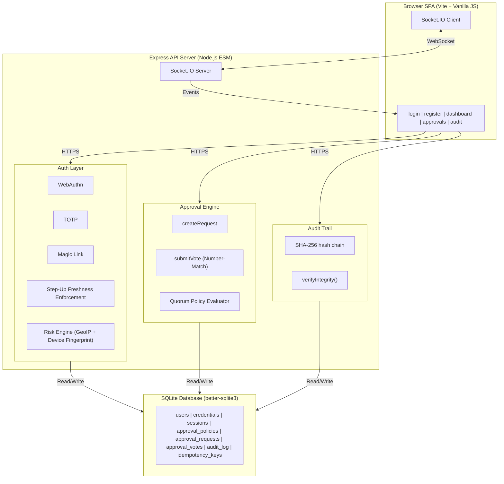
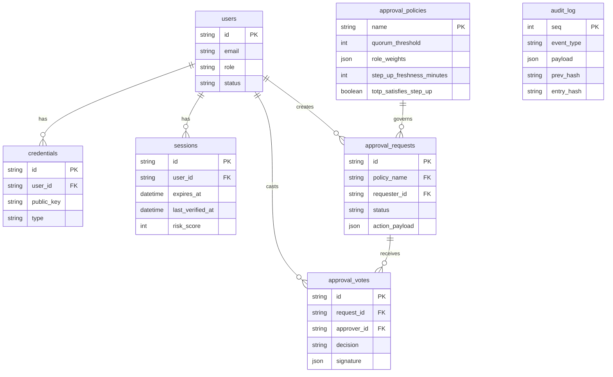

# 🛡️ Commander Auth – Zero-Password Auth & Approval Platform

<div align="center">


**One adaptive authorization core — the same engine that decides who can log in also decides who can approve what — deployed across three real-world personas (bank customer, student, startup integrator), not three separate flows. Zero-password authentication with cryptographically signed multi-party approvals, role-weighted quorum consensus, and a tamper-evident hash-chained audit trail.**

> Built by team **404Found**


[🌐 View Live Deployment](https://commander-auth-404found.onrender.com) · [📖 Architecture](docs/ARCHITECTURE.md)

</div>

---

## 📸 Screenshots

<table>
  <tr>
    <td align="center">
      
      <br/><b>🖥️ Persona Dashboard</b>
      <br/><sub>Bank / Student / Startup toggle, live risk score</sub>
    </td>
    <td align="center">
      
      <br/><b>✅ Approval Queue</b>
      <br/><sub>Role-weighted quorum tally climbing in real time</sub>
    </td>
  </tr>
  <tr>
    <td align="center">
      
      <br/><b>🔏 Signed Vote Verification</b>
      <br/><sub>WebAuthn assertion + public-key fingerprint</sub>
    </td>
    <td align="center">
      
      <br/><b>🔗 Tamper-Evident Audit Chain</b>
      <br/><sub>Immediate visual proof of data integrity</sub>
    </td>
  </tr>
</table>

---

## 📋 Table of Contents

- [Overview](#-overview)
- [Key Features](#-key-features)
- [Security & Trust Engine](#-security--trust-engine)
- [System Architecture](#-system-architecture)
- [Tech Stack](#-tech-stack)
- [Project Structure](#-project-structure)
- [Setup & Deployment](#-setup--deployment)
- [Security Properties](#-security-properties)
- [Data Model](#-data-model)

---

## 🌟 Overview

Commander Auth is a hackathon platform built around one thesis: **authentication and approval are the same underlying primitive** — *is this specific event sufficiently authorized, given its risk, in a way that can be proven and cannot be credibly denied?*

Instead of treating "login" and "approve this action" as separate features, Commander Auth runs both through one **Adaptive Auth Core → Step-Up Approval Engine → Quorum Policy Engine → Signed, Hash-Chained Audit Trail** pipeline.

It directly maps to the hackathon's core problem statement requirements:
- **Risk-adaptive login**: Evaluates device fingerprint, location, and recovery status to restrict factors dynamically.
- **MFA Fatigue Resistance**: Forces a 2-digit number-matching challenge before any approval vote.
- **Dispute-resolution / Non-repudiation**: Enforces mandatory WebAuthn-signed votes on sensitive policies, backed by a SHA-256 hash-chained audit log.
- **SIM-swap Risk**: SMS is completely excluded by design.
- **Graceful degradation**: Seamless fallback from WebAuthn to TOTP.

---

## ✨ Key Features

### 🔑 Adaptive Auth Core
| Feature | Description |
|---------|-------------|
| **WebAuthn / Passkeys** | Primary factor for supported devices, no password ever stored |
| **TOTP (RFC 6238)** | Fallback factor for accounts without a registered passkey |
| **Risk-Adaptive Factor Selection** | High risk forces WebAuthn only; low risk allows TOTP |
| **Number-Matching Anti-Fatigue** | 2-digit confirmation challenges counter push-approval fatigue |
| **Magic Link Recovery** | Isolated solely for account recovery when a passkey device is lost |

### ✅ Approval & Quorum Engine
| Feature | Description |
|---------|-------------|
| **Generic Policy Primitive** | Any action type can be gated behind a strictly enforced approval policy |
| **N-of-M, Role-Weighted** | Quorum thresholds configurable per policy with varying role weights |
| **Per-Policy Step-Up Freshness** | Policies define custom step-up windows (e.g., 5 min vs 15 min freshness) |
| **Idempotency Keys** | All write endpoints are safe against network retries |

### 🔗 Audit & Non-Repudiation
| Feature | Description |
|---------|-------------|
| **SHA-256 Hash Chain** | Every audit event links to the previous event's hash |
| **One-Click Tamper Demo** | Break any entry to watch the downstream chain instantly flag red |
| **Signature Verification Modal** | Re-derive and mathematically compare a vote's public-key fingerprint |

---

## 🤖 Security & Trust Engine

> The hardest requirement in the brief isn't login — it's proving, after the fact, that a specific person authorized a specific action in a way even they can't deny.

### Components

```
🛡️ trust-engine/
├── 🔑 Adaptive Auth Core
│   ├── WebAuthn / passkey verification
│   ├── TOTP fallback (RFC 6238)
│   ├── Magic-link recovery flow
│   └── Risk scorer (geo-IP + device fingerprint + auth method)
│
├── ✅ Step-Up Approval Engine
│   ├── Generic approval primitive (any action type)
│   ├── Idempotency-key deduplication
│   └── Freshness window enforcement (5 min)
│
├── ⚖️ Quorum Policy Engine
│   ├── M-of-N threshold evaluation
│   ├── Role-weight aggregation (admin=3, senior=2, member=1)
│   └── Mandatory-signing flag per policy
│
└── 🔗 Audit Chain
    ├── SHA-256 hash-chained event log
    ├── Chain verification (walk + compare)
    └── Tamper injection + recovery (demo-only)
```

---

## 🏗️ System Architecture

The system operates across three tiers: a Vite SPA, an Express backend with an adaptive auth core and policy engine, and a SQLite persistence layer.



---

## 🛠️ Tech Stack

| Layer | Technology |
|-------|-----------|
| **Runtime** | Node.js (ES modules) |
| **Server** | Express.js |
| **Database** | **SQLite (better-sqlite3)** |
| **Real-time** | Socket.IO |
| **Frontend** | Vite + Vanilla JS |
| **WebAuthn** | @simplewebauthn/server + browser |
| **TOTP** | otpauth (RFC 6238) |
| **Deployment**| Render |

> **This project uses SQLite via better-sqlite3 as its sole data store.**
> It provides full control over the auth pipeline, a single-file database that is trivial to inspect or reset for demos, and zero cloud dependency.

---

## 📁 Project Structure

```
404Found/
├── server/
│   ├── index.js               # Express entry point, serves built SPA
│   ├── routes/
│   │   ├── auth.js             # WebAuthn / TOTP / magic-link
│   │   ├── approvals.js        # Approval + quorum endpoints
│   │   └── audit.js            # Audit chain + verify/tamper
│   ├── engine/
│   │   ├── riskScorer.js       # Adaptive risk scoring
│   │   ├── quorum.js           # M-of-N + role-weight evaluation
│   │   └── hashChain.js        # SHA-256 chain build + verify
│   └── db/
│       ├── schema.sql
│       └── seed.js             # Demo account + policy seeding
│
├── client/                     # Vite + Vanilla JS SPA
│   ├── dashboard/               # Persona toggle, risk view
│   ├── approvals/                # Queue, signed vote modal
│   └── audit/                    # Chain explorer, tamper demo
│
├── docs/
│   ├── ARCHITECTURE.md
│   ├── THREAT_MODEL.md
│   ├── API_REFERENCE.md
│   └── DEMO_SCRIPT.md
│
├── render.yaml
└── package.json
```

---

## 🚀 Setup & Deployment

### Prerequisites
- Node.js 18+
- npm

### 1. Clone & Install
```bash
git clone <repo-url>
cd 404Found
npm install
```

### 2. Configure & Run
```bash
cp .env.example .env
npm run dev
```
This starts both the Express server (port 3000) and Vite dev server (port 5173).

### Useful Commands
```bash
npm run dev         # Start dev servers (Express + Vite)
npm run seed        # Seed demo data (runs automatically on startup)
npm run reset-db    # Delete DB and re-seed (clean state for demos)
npm test            # Run E2E tests (32 checks: auth, quorum, audit, signing)
```

---

## 🔐 Security Properties

| Property | Implementation |
|-------|---------------|
| **Non-repudiation** | Votes on sensitive policies require WebAuthn assertion — cryptographic proof of identity |
| **Tamper evidence** | Audit log entries are SHA-256 hash-chained; modifying any entry breaks the chain |
| **Idempotency** | All write endpoints accept `Idempotency-Key` headers — safe for network retries |
| **Risk-adaptive login** | Pre-login risk assessment restricts available factors by context — high risk forces WebAuthn only |
| **Per-policy step-up** | Each policy defines its own freshness window and accepted step-up factors, enforced server-side |
| **No SMS by design** | Phone-based OTP intentionally excluded — SIM-swapping and SS7 make it unsuitable |

---

## 📊 Data Model

The relational model includes configurations for per-policy step-up parameters, ensuring freshness windows and permitted factors are defined strictly in the database, not hardcoded.



---

## 📄 License

MIT License — Free to use for educational, research, and non-commercial purposes.

---

<div align="center">

Built with 🔐 for a world with fewer passwords and better proof.

**Commander Auth** — *Prove it happened. Prove who approved it. Prove it can't be denied.*

</div>
