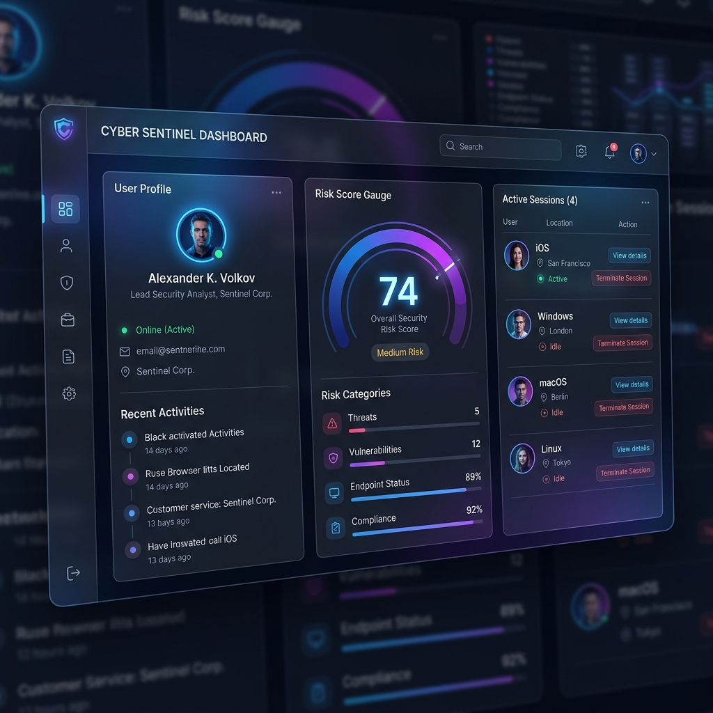
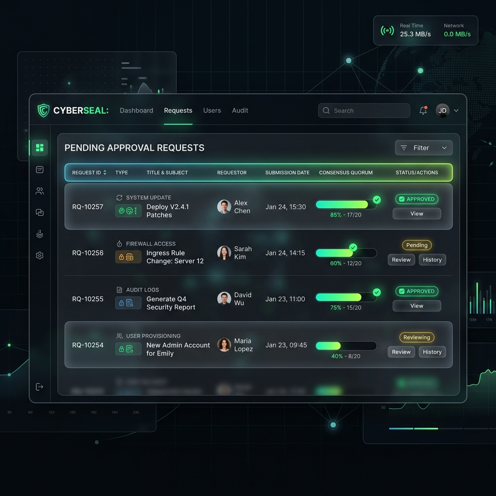
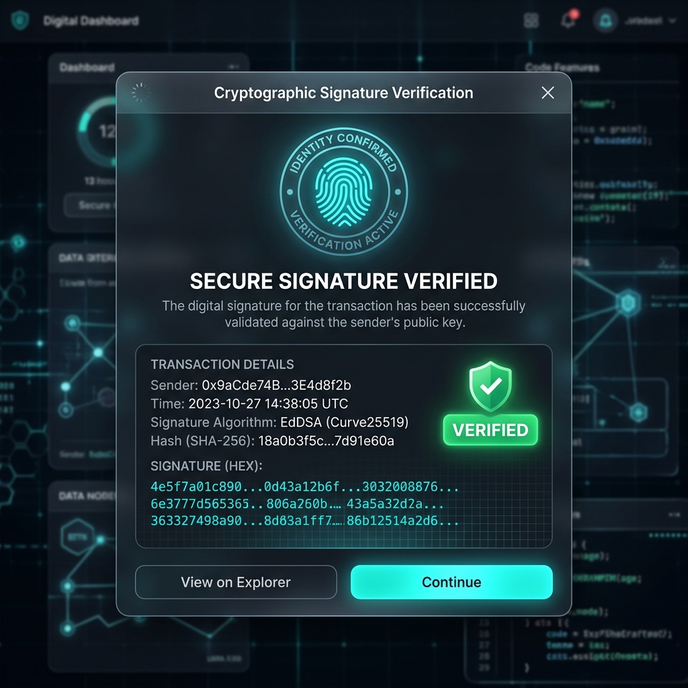
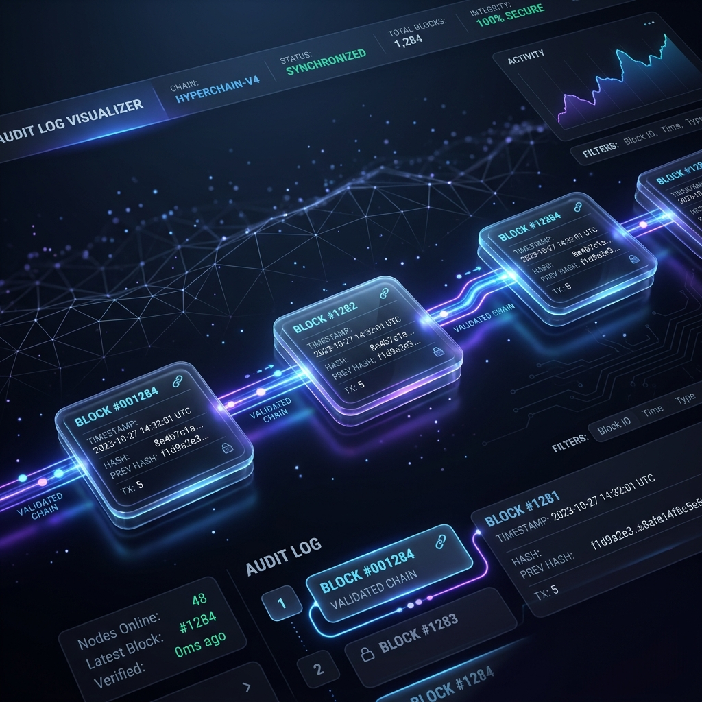
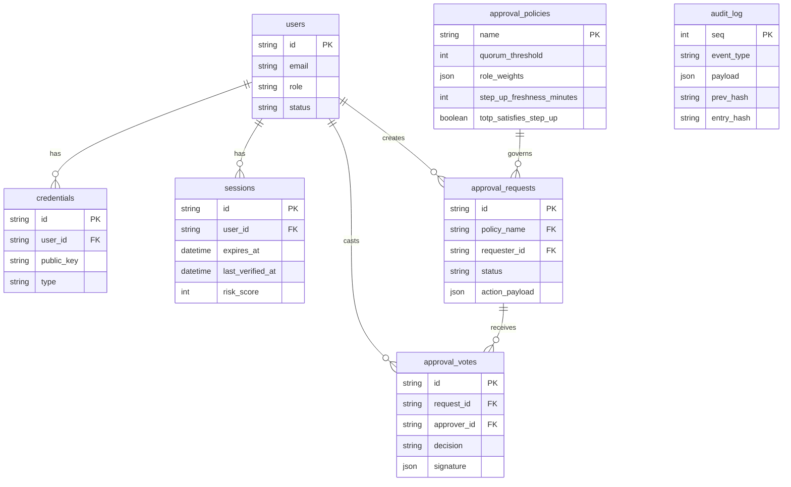

# Commander Auth

An adaptive authorization core that treats authentication and approvals as the same underlying primitive. This system provides zero-password authentication, cryptographically signed multi-party approvals, role-weighted quorum consensus, and a tamper-evident audit trail.

## Live Demo

**[🌐 View Live Deployment](https://commander-auth.onrender.com)**

### Demo Accounts

The database is seeded with the following accounts for testing. All accounts use TOTP by default; use `npm run seed -- --show-qr` locally to register their TOTP URIs, or test using the pre-seeded passkey accounts.

| Account | Email | Role | Weight | Passkey |
|---|---|---|---|---|
| Alice | alice@demo.local | member | 1 | — |
| Bob | bob@demo.local | senior | 2 | ✅ Pre-registered |
| Carol | carol@demo.local | member | 1 | ✅ Pre-registered |
| Dave | dave@demo.local | member | 1 | — |
| Admin | admin@demo.local | admin | 3 | — |

---

## Problem Statement Alignment

This platform directly maps to the hackathon's core problem statement requirements:

*   **Risk-adaptive login**: Implemented via a custom risk engine. Login attempts are scored based on device fingerprint, location, and recovery status. The UI restricts which factors are available—disabling TOTP and requiring WebAuthn during high-risk conditions.
*   **MFA Fatigue Resistance**: To prevent "tap yes in a hurry" attacks, the system forces a number-matching challenge (a 2-digit confirmation) before any approval vote can be submitted.
*   **Dispute-resolution / Non-repudiation**: Solved by enforcing mandatory WebAuthn-signed votes on sensitive policies, combined with a SHA-256 hash-chained audit log that makes historical tampering immediately evident.
*   **Persona-driven variations without disjointed flows**: The platform utilizes a single, generalized step-up primitive deployed across three distinct policies (`high-value-transaction`, `production-deploy`, `academic-submission`). These policies enforce genuinely different step-up windows (e.g., 5 vs 15 minutes) and acceptable factors entirely on the server side.
*   **SIM-swap and SS7 Risk**: Addressed by deliberate omission. SMS is excluded from the platform by design to avoid reliance on vulnerable telco networks.
*   **Graceful degradation**: The login system allows falling back from WebAuthn to TOTP if offline or using an unsupported device (demonstrable via the UI's degraded-network toggle), assuming the risk score permits it.

---

## Features & Screenshots

### Persona Dashboard
The system adapts to distinct user personas (Bank Customer, Student, Startup Developer). The risk score is evaluated dynamically on login.



### Approval Queue
Requests are evaluated via an M-of-N role-weighted quorum system. The tally climbs as different roles vote (e.g., Admin=3, Senior=2, Member=1).



### Verify Signature
For sensitive policies, unsigned votes are rejected at the API level. Each vote requires a WebAuthn assertion tied to the approver's public key, verifiable on demand.



### Tamper-Evident Audit Chain
Every event (auth, approval, policy change) is appended to a SHA-256 hash chain. Modifying any historical entry breaks the downstream chain.



*The chain immediately turns red when tampered with, proving data integrity.*


### Adaptive Login
The login page assesses risk before presenting authentication options. Magic links are isolated solely for account recovery to protect the primary authentication flow.


---

## Architecture Diagram

The system operates across three tiers: a Vite SPA, an Express backend with an adaptive auth core and policy engine, and a SQLite persistence layer.

```mermaid
graph TD
    %% Browser Layer
    subgraph Browser["Browser SPA (Vite + Vanilla JS)"]
        UI["login | register | dashboard | approvals | audit"]
        WSClient["Socket.IO Client"]
    end

    %% Express API Server
    subgraph Server["Express API Server (Node.js ESM)"]
        subgraph AuthLayer["Auth Layer"]
            WebAuthn["WebAuthn"]
            TOTP["TOTP"]
            MagicLink["Magic Link"]
            StepUp["Step-Up Freshness Enforcement"]
            RiskEngine["Risk Engine (GeoIP + Device Fingerprint)"]
            AuthLayer --> RiskEngine
        end

        subgraph ApprovalEngine["Approval Engine"]
            CreateReq["createRequest"]
            SubmitVote["submitVote (Number-Match)"]
            EvaluateQ["Quorum Policy Evaluator"]
        end

        subgraph AuditTrail["Audit Trail"]
            HashChain["SHA-256 hash chain"]
            VerifyInt["verifyIntegrity()"]
        end

        WSServer["Socket.IO Server"]
    end

    %% Database Layer
    subgraph DB["SQLite Database (better-sqlite3)"]
        Tables["users | credentials | sessions | approval_policies | approval_requests | approval_votes | audit_log | idempotency_keys"]
    end

    %% Connections
    UI -->|HTTPS| AuthLayer
    UI -->|HTTPS| ApprovalEngine
    UI -->|HTTPS| AuditTrail
    WSClient <-->|WebSocket| WSServer

    AuthLayer -->|Read/Write| DB
    ApprovalEngine -->|Read/Write| DB
    AuditTrail -->|Read/Write| DB
    WSServer -->|Events| UI
```

---

## Data Model

The relational model includes configurations for per-policy step-up parameters, ensuring freshness windows and permitted factors are defined strictly in the database, not hardcoded.



---

## Tech Stack

| Layer | Technology |
|---|---|
| Runtime | Node.js (ES modules) |
| Server | Express.js |
| **Database** | **SQLite (better-sqlite3)** |
| Real-time | Socket.IO |
| Frontend | Vite + Vanilla JS |
| WebAuthn | @simplewebauthn/server + browser |
| TOTP | otpauth (RFC 6238) |
| Geo-IP | geoip-lite (bundled, offline) |
| Deployment | Render (free tier) |

> **This project uses SQLite via better-sqlite3 as its sole data store.**
> SQLite provides full control over the auth pipeline, a single-file database that is trivial to inspect or reset for demos, and zero cloud dependency.

---

## Quick Start

### Prerequisites
- Node.js 18+
- npm

### 1. Clone & Install
```bash
git clone <repo-url>
cd 404Found
npm install
```

### 2. Configure & Run
```bash
cp .env.example .env
npm run dev
```
This starts both the Express server (port 3000) and Vite dev server (port 5173).

### Useful Commands
```bash
npm run dev         # Start dev servers (Express + Vite)
npm run seed        # Seed demo data (runs automatically on startup)
npm run reset-db    # Delete DB and re-seed (clean state for demos)
npm test            # Run E2E tests (32 checks: auth, quorum, audit, signing)
```

## License

MIT License — Free to use for educational, research, and non-commercial purposes.
